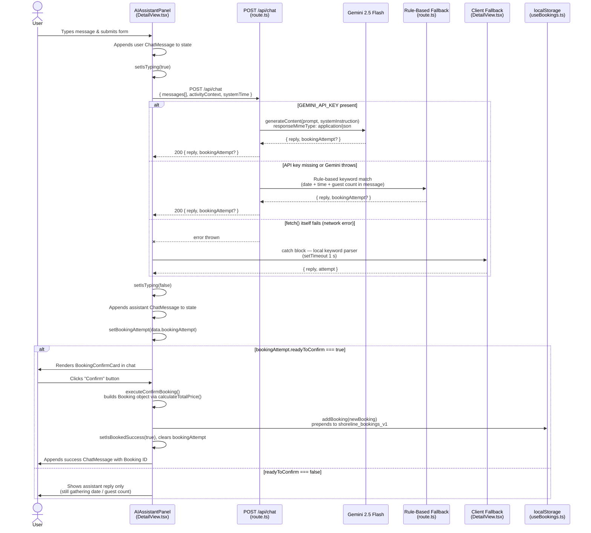
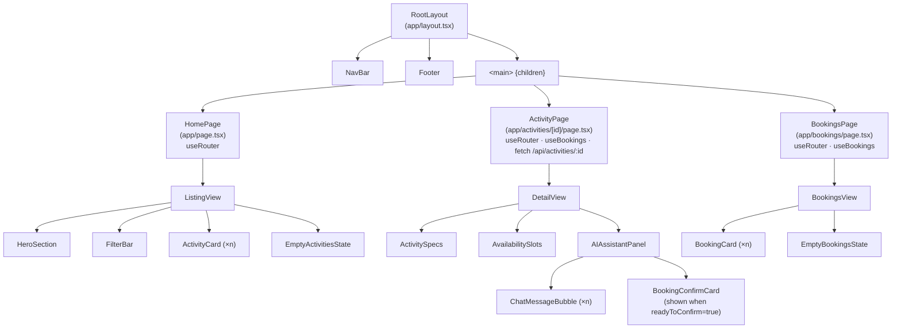

# Architecture Diagrams

## AI Booking Chat — Data Flow

**Key facts from the code:**

- `bookingAttempt` shape: `{ date, time, people, readyToConfirm }` — returned by both Gemini and the fallbacks.
- The server-side fallback (`route.ts` lines 140–201) matches hard-coded date strings ("JUNE 12", "JUNE 13") and a digit regex.
- The client-side fallback (`DetailView.tsx` lines 91–142) is only reached when the `fetch()` itself throws (network error), not on a non-2xx response.
- `executeConfirmBooking()` (`DetailView.tsx:150`) constructs the `Booking` and calls `onAddBooking`, which is `useBookings.addBooking` — that writes to `localStorage` under key `shoreline_bookings_v1`.
- The success message on line 179 hardcodes "June 12" (known bug — it should use `newBooking.date`).

## React Component Hierarchy

**Key facts from the code:**

- `RootLayout` (`app/layout.tsx`) wraps every route with `NavBar` and `Footer`; the route page renders into `<main>`.
- Page components own routing (`useRouter`) and data fetching. `ActivityPage` fetches `GET /api/activities/[id]` client-side and owns the `useBookings` hook; confirming a booking calls `addBooking` then redirects to `/bookings`.
- `BookingsPage` also owns `useBookings` directly — both pages read/write the same `localStorage` key (`shoreline_bookings_v1`) via the hook.
- `DetailView` holds all chat state (`messages`, `bookingAttempt`, `isTyping`) and passes callbacks down to `AIAssistantPanel`. `BookingConfirmCard` is rendered inline in the chat stream, not as a modal.
- `AvailabilitySlots` clicking a slot calls `handleSendMessage` with a pre-filled prompt, bypassing the text input.
