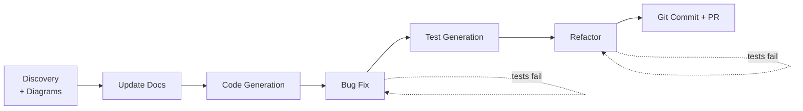

# Demo Runbook — Claude Code: Common Development Workflows

> **Companion to the deck** `05_Common_Development_Workflows.pdf` (Masterclass #3).
> This is the **live‑demo playbook** for the 40‑minute hands‑on block. It turns the
> theory slides into a single, chained session on the real **Shoreline** Next.js
> codebase: from onboarding a repo all the way to a pull request.
>
> Everything below has been verified against the repo. The demo material is **already
> present in the code** — nothing is faked on stage.

---

## 0. How to use this runbook

Each segment has the same shape:

| Field | Meaning |
|---|---|
| 🎞 **Slides** | Which deck slides this segment delivers |
| ⏱ **Budget** | Rough time on stage |
| 🎯 **Target** | The exact file/line in this repo you'll act on |
| 💬 **Prompt** | Copy‑paste prompt(s) — written to the deck's "strong prompt" pattern |

**The spine of the demo is one story:** you "join" the Shoreline project, discover its
docs are stale, fix them, build a small feature, fix a real bug, back it with tests,
refactor away duplication, and ship a PR — *one logical unit of work, one session.*
That's Slide 42 (Workflow Chaining) made real.

---

## 1. Pre‑flight (do this before the audience is watching)

```bash
# 1. Be on the clean demo baseline
git switch demo/start        # the pre-staged starting point
git status                   # should be clean

# 2. Prove the toolchain is green
npm install                  # if node_modules isn't present
npm test                     # golden test passes (7 passing)
npx tsc --noEmit             # type-check passes

# 3. (optional) run the app so the bug is visible in a browser
npm run dev                  # http://localhost:3000
```

**Reset between rehearsals:** `bash scripts/demo-reset.sh` (discards demo edits and
returns you to `demo/start`). See [scripts/demo-reset.sh](../scripts/demo-reset.sh).

**Pre-staged for you (so the live demo is low‑risk):**
- ✅ Jest configured via `next/jest` (no Vite) — `jest.config.mjs`, `jest.setup.ts`
- ✅ A **golden** reference unit + test: `src/lib/pricing.ts` + `src/lib/__tests__/pricing.test.ts`
- ✅ `.claude/settings.json` — a curated `allow` list so safe commands don't prompt mid-demo (Slide 5 fix)
- ✅ `.claude/commands/update-docs.md` — the `/update-docs` slash command (Slides 18 & 22)
- ✅ The `new-api-route` **skill is built live** in Segment 3 (intentionally *not* pre-installed); the finished, validated copy is at [docs/demo-assets/new-api-route.SKILL.md](demo-assets/new-api-route.SKILL.md) as a fallback
- ✅ Seeded demo material left intentionally in place (see [§11 Seed map](#11-seed-map))

**Two house rules to repeat all session (Slide 4 + Slide 5):**
1. Describe the **goal and constraint**, not the solution.
2. Always give Claude a **way to verify** — a test, a build, a running app.

---

## 2. The pipeline at a glance



| # | Segment | Workflow covered | Slides | ⏱ |
|---|---|---|---|---|
| 1 | Discovery + Mermaid diagrams | Discovery, **data‑flow & component diagrams** | 6, 9 | 5 |
| 2 | Update documentation | **Documentation** | 17–23 | 5 |
| 3 | Code generation | **Code generation** (+ Skills/Plan Mode) | 10–16 | 5 |
| 4 | Bug fix | **Bug fixing** | 30–32 | 6 |
| 5 | Test generation | **Test generation** | 27–29 | 5 |
| 6 | Refactoring | **Refactoring** | 24–26 | 7 |
| 7 | Git & PR | **Working with Git** | 38–40, 42 | 4 |

---

## Segment 1 — Discovery & Mermaid Diagrams

- 🎞 **Slides:** 6 (multi‑file context), 9 (use‑case mind map → "Discovery & Understanding")
- ⏱ **Budget:** 5 min
- 🎯 **Target:** the whole repo; output goes to `docs/architecture.md`

💬 **Prompt 1 — orient:**
```
Explain this codebase to me starting from the entry point. What framework is it,
what are the screens, and how does a booking get created end to end? Keep it to
the key files.
```

💬 **Prompt 2 — data‑flow diagram:**
```
Create a Mermaid sequence (or flowchart) diagram of the AI booking chat data flow:
from the user typing in the chat panel, through /api/chat (Gemini vs the rule-based
fallback), to the booking being confirmed and saved. Base it on the actual code.
Save it to docs/architecture.md.
```

💬 **Prompt 3 — component hierarchy:**
```
Now add a Mermaid diagram of the React component hierarchy: the layout, the three
routes, and the components each screen composes. Append it to docs/architecture.md.
```

---

## Segment 2 — Update Documentation

- 🎞 **Slides:** 17–23 (documentation; tiers HOT/WARM/COLD; "triggered, not scheduled")
- ⏱ **Budget:** 5 min
- 🎯 **Target:** [CLAUDE.md](../CLAUDE.md) and [README.md](../README.md) — **both are wrong on purpose** (see [§11](#11-seed-map))

> **The reveal:** `CLAUDE.md` describes an *Express + Vite + `server.ts` + `App.tsx`* app.
> The real app is **Next.js 15 App Router**. It even names model `gemini-3.5-flash`
> while the code calls `gemini-2.5-flash`. `README.md` is generic AI‑Studio boilerplate.
> This is the Slide 5 pitfall ("empty/stale CLAUDE.md") live.

💬 **Prompt — run the staged slash command:**
```
/update-docs 5
```
*(or, spelled out, the Slide 18 prompt:)*
```
Review the actual code and update CLAUDE.md and README.md so they match reality.
CLAUDE.md currently describes an Express + Vite app with a server.ts and an App.tsx
router — but this is a Next.js 15 App Router project. Fix the framework, the commands,
the real API routes under src/app/api, and the model name. Generate a real README
(overview, prerequisites, install, env vars from .env.example, the actual API
endpoints, dev workflow). Base everything on the code, not assumptions. Show me an
audit table and the diffs before writing.
```
---

## Segment 3 — Code Generation + Build a Skill

- 🎞 **Slides:** 10–16 (boilerplate to conventions, Skills, Plan Mode, readiness checklist)
- ⏱ **Budget:** 9 min (5 for the route, ~4 for the live skill build + reuse)
- 🎯 **Targets:** (1) `src/app/api/activities/[id]/availability/route.ts` following the
  **golden pattern** in [src/app/api/activities/[id]/route.ts](../src/app/api/activities/%5Bid%5D/route.ts);
  (2) a new skill at `.claude/skills/new-api-route/SKILL.md`, built live; (3) a second
  route generated *by* the skill.

> **This is the Skills payoff (Slide 11).** demo/start ships **without** the skill, so the
> build is genuine. The finished, validated SKILL.md is committed as a reference/fallback at
> [docs/demo-assets/new-api-route.SKILL.md](demo-assets/new-api-route.SKILL.md) and reproduced
> in [§13 Appendix B](#13-appendix-b--new-api-route-skill-answer-key).

### Step 1 — generate the first route by hand (pattern-matching)

💬 **Prompt:**
```
Generate a new API route: GET /api/activities/[id]/availability that returns just
the bookable slots for an activity (id, date, time, spotsLeft, full) plus a
`spotsTotal` sum. Follow EXACTLY the pattern in
src/app/api/activities/[id]/route.ts — same params handling, same 404 shape, same
JSDoc header style, NextResponse.json. Then show me how to verify it with curl.
```

✅ **Expected:** a route file mirroring the golden one's JSDoc + `params: Promise<{id}>` +
404 shape. 🔍 **Verify:**
```bash
npx tsc --noEmit
curl -s localhost:3000/api/activities/beginner-surf/availability | head
curl -s -o /dev/null -w "%{http_code}\n" localhost:3000/api/activities/nope/availability   # 404
```

### Step 2 — capture it as a skill (live: "what one looks like + how to build it")

💬 **Prompt:**
```
Turn what you just did into a reusable skill at .claude/skills/new-api-route/SKILL.md.
The description must make Claude reach for it automatically whenever I ask to add an
API route — so be specific about when it applies. Capture the conventions you just
followed: JSDoc header documenting the response shapes, typed Promise params,
NextResponse.json, the { error } 404 shape, modeled on the activities routes. End
with a tsc + curl verification checklist.
```

✅ **Expected:** a `SKILL.md` with YAML frontmatter (`name` + a specific `description`
trigger) and a recipe body. 🖥️ Open it and narrate the two parts: **description = the
auto-fire trigger**, **body = the recipe**.

### Step 3 — reuse it (live: skill auto-fires, no instructions)

💬 **Prompt** — deliberately says nothing about patterns or golden files:
```
Add a GET /api/activities/[id]/reviews endpoint that returns the activity's rating,
reviewsCount, and tags.
```
---

## Segment 4 — Bug Fix

- 🎞 **Slides:** 30–32 (bug fixing; repro test first; structured report; two‑attempt rule)
- ⏱ **Budget:** 6 min
- 🎯 **Target:** [src/components/DetailView.tsx:178](../src/components/DetailView.tsx#L178) — the success
  message **hardcodes "June 12"** regardless of the booked date.

> **The bug:** book the **June 13** slot, confirm it, and the success chat bubble still
> says *"Your reservation for June 12 was successfully registered…"*. It ignores
> `newBooking.date`.

💬 **Prompt — structured bug report (Slide 32 format):**
```
Bug: after confirming a booking, the success message always says "June 12" even when
the guest booked June 17.
- Symptom: chat success bubble shows the wrong date.
- Affected file: src/components/DetailView.tsx, executeConfirmBooking (~line 178).
- Repro: open an activity, pick a June 17 slot, confirm, read the success message.
First write a failing test that proves the bug (the success message should contain the
booked date), confirm it fails, then fix it, then show the test passing.
```
---

## Segment 5 — Test Generation

- 🎞 **Slides:** 27–29 (test generation; match existing patterns; coverage gaps; edge cases)
- ⏱ **Budget:** 5 min
- 🎯 **Target:** untested logic — [src/hooks/useBookings.ts](../src/hooks/useBookings.ts) and the rule‑based
  parser in [src/app/api/chat/route.ts](../src/app/api/chat/route.ts). Golden pattern to match:
  [src/lib/__tests__/pricing.test.ts](../src/lib/__tests__/pricing.test.ts).

💬 **Prompt — coverage gap finder (Slide 28):**
```
Run `npm run test:coverage` and identify the most important untested code paths.
Focus on business logic: the useBookings hook (add, cancel, localStorage persistence,
the corrupt-JSON fallback) and the rule-based booking parser in the /api/chat fallback
(edge cases: FULL slot, group size over maxGroupSize, no date, plural vs singular guest).
For each gap: explain why it matters, then write tests that MATCH the style of
src/lib/__tests__/pricing.test.ts. Verify they pass.
```
---

## Segment 6 — Refactoring

- 🎞 **Slides:** 24–26 (Plan Mode; goal not solution; incremental + tested; defensive‑pattern awareness)
- ⏱ **Budget:** 7 min
- 🎯 **Target:** the **duplicated** rule‑based booking parser — it lives in **both**
  [src/app/api/chat/route.ts](../src/app/api/chat/route.ts#L140) (server fallback) and
  [src/components/DetailView.tsx:91](../src/components/DetailView.tsx#L91) (client fallback),
  with slightly different behaviour. `handleSendMessage` is also ~100 lines.

💬 **Prompt — Plan Mode first (Shift+Tab), describe the problem (Slide 25):**
```
Goal: single source of truth for the rule-based booking parser. Current problem: the
"parse a date/time/people from a guest message" logic is duplicated in
src/app/api/chat/route.ts (server fallback) and src/components/DetailView.tsx (client
fallback), and the two versions disagree. This makes them impossible to test once and
keep in sync. Don't change code yet — present 2–3 approaches with trade-offs.
```
Then, after approving a plan:
```
Implement option <N> incrementally: extract a pure parseBookingIntent() into
src/lib/, point both call sites at it, and run `npm test` after each step. Keep
behaviour unchanged.
```
---

## Segment 7 — Git & Pull Request

- 🎞 **Slides:** 38–40 (commit conventions, worktrees, PR creation), 42 (chaining → PR)
- ⏱ **Budget:** 4 min
- 🎯 **Target:** stage the session's work into clean conventional commits, open a PR.

💬 **Prompt — commit (Slide 39, "show me first"):**
```
Review my changes and propose a series of Conventional Commits — one logical change
each (docs, the new endpoint, the bug fix, the tests, the refactor). Subject under
72 chars, body explains WHY. Don't commit yet — show me the messages first.
```

💬 **Prompt — PR:**
```
Create a PR description with sections: Summary, What changed (grouped), How to test,
Screens affected. Derive it from the commits/diff. Then create it with `gh pr create`.
```
---
