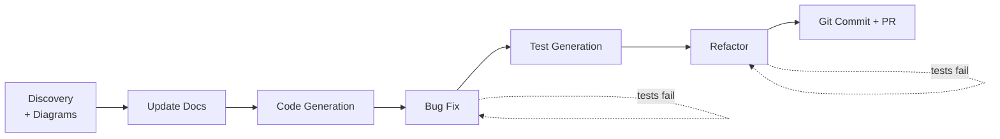
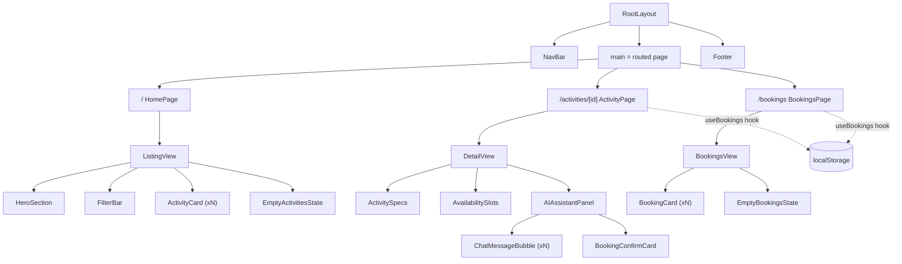

# Demo Runbook — Claude Code: Common Development Workflows

> **Companion to the deck** `05_Common_Development_Workflows.pdf` (Masterclass #3).
> This is the **live‑demo playbook** for the 40‑minute hands‑on block. It turns the
> theory slides into a single, chained session on the real **Shoreline** Next.js
> codebase: from onboarding a repo all the way to a pull request.
>
> Everything below has been verified against the repo. The demo material is **already
> present in the code** — nothing is faked on stage.

---

## 0. How to use this runbook

Each segment has the same shape:

| Field | Meaning |
|---|---|
| 🎞 **Slides** | Which deck slides this segment delivers |
| ⏱ **Budget** | Rough time on stage |
| 🎯 **Target** | The exact file/line in this repo you'll act on |
| 💬 **Prompt** | Copy‑paste prompt(s) — written to the deck's "strong prompt" pattern |
| ✅ **Expected** | What Claude should do, so you can narrate confidently |
| 🔍 **Verify** | The feedback loop — how you (and Claude) prove it worked |
| 🗣 **Talking points** | The principle to say out loud while it runs |
| ⚠️ **Fallback** | What to do if the live model goes off‑script |

**The spine of the demo is one story:** you "join" the Shoreline project, discover its
docs are stale, fix them, build a small feature, fix a real bug, back it with tests,
refactor away duplication, and ship a PR — *one logical unit of work, one session.*
That's Slide 42 (Workflow Chaining) made real.

---

## 1. Pre‑flight (do this before the audience is watching)

```bash
# 1. Be on the clean demo baseline
git switch demo/start        # the pre-staged starting point
git status                   # should be clean

# 2. Prove the toolchain is green
npm install                  # if node_modules isn't present
npm test                     # golden test passes (7 passing)
npx tsc --noEmit             # type-check passes

# 3. (optional) run the app so the bug is visible in a browser
npm run dev                  # http://localhost:3000
```

**Reset between rehearsals:** `bash scripts/demo-reset.sh` (discards demo edits and
returns you to `demo/start`). See [scripts/demo-reset.sh](../scripts/demo-reset.sh).

**Pre-staged for you (so the live demo is low‑risk):**
- ✅ Jest configured via `next/jest` (no Vite) — `jest.config.mjs`, `jest.setup.ts`
- ✅ A **golden** reference unit + test: `src/lib/pricing.ts` + `src/lib/__tests__/pricing.test.ts`
- ✅ `.claude/settings.json` — a curated `allow` list so safe commands don't prompt mid-demo (Slide 5 fix)
- ✅ `.claude/commands/update-docs.md` — the `/update-docs` slash command (Slides 18 & 22)
- ✅ Seeded demo material left intentionally in place (see [§11 Seed map](#11-seed-map))

**Two house rules to repeat all session (Slide 4 + Slide 5):**
1. Describe the **goal and constraint**, not the solution.
2. Always give Claude a **way to verify** — a test, a build, a running app.

---

## 2. The pipeline at a glance



| # | Segment | Workflow covered | Slides | ⏱ |
|---|---|---|---|---|
| 1 | Discovery + Mermaid diagrams | Discovery, **data‑flow & component diagrams** | 6, 9 | 5 |
| 2 | Update documentation | **Documentation** | 17–23 | 5 |
| 3 | Code generation | **Code generation** (+ Skills/Plan Mode) | 10–16 | 5 |
| 4 | Bug fix | **Bug fixing** | 30–32 | 6 |
| 5 | Test generation | **Test generation** | 27–29 | 5 |
| 6 | Refactoring | **Refactoring** | 24–26 | 7 |
| 7 | Git & PR | **Working with Git** | 38–40, 42 | 4 |

---

## Segment 1 — Discovery & Mermaid Diagrams

- 🎞 **Slides:** 6 (multi‑file context), 9 (use‑case mind map → "Discovery & Understanding")
- ⏱ **Budget:** 5 min
- 🎯 **Target:** the whole repo; output goes to `docs/architecture.md`

💬 **Prompt 1 — orient:**
```
Explain this codebase to me starting from the entry point. What framework is it,
what are the screens, and how does a booking get created end to end? Keep it to
the key files.
```

💬 **Prompt 2 — data‑flow diagram:**
```
Create a Mermaid sequence (or flowchart) diagram of the AI booking chat data flow:
from the user typing in the chat panel, through /api/chat (Gemini vs the rule-based
fallback), to the booking being confirmed and saved. Base it on the actual code.
Save it to docs/architecture.md.
```

💬 **Prompt 3 — component hierarchy:**
```
Now add a Mermaid diagram of the React component hierarchy: the layout, the three
routes, and the components each screen composes. Append it to docs/architecture.md.
```

✅ **Expected:** Claude greps the tree, identifies **Next.js 15 App Router** (not what
CLAUDE.md claims!), and produces two diagrams close to the reference in
[§10 Appendix A](#10-appendix-a--reference-diagrams-answer-key).

🔍 **Verify:** open `docs/architecture.md` in the IDE's Markdown preview — Mermaid renders.

🗣 **Talking points:**
- "Claude doesn't wait for instructions — it *explores*: glob, grep, sub‑agents." (Slide 6)
- "Onboarding to an unfamiliar repo is one of the most underused wins." (Slide 9)
- Plant the hook for Segment 2: *"Notice it said Next.js. Hold that thought — go read CLAUDE.md."*

⚠️ **Fallback:** if a diagram has a syntax error, paste the error back — fixing its own
Mermaid is a 5‑second loop. Reference diagrams are in [§10](#10-appendix-a--reference-diagrams-answer-key).

---

## Segment 2 — Update Documentation

- 🎞 **Slides:** 17–23 (documentation; tiers HOT/WARM/COLD; "triggered, not scheduled")
- ⏱ **Budget:** 5 min
- 🎯 **Target:** [CLAUDE.md](../CLAUDE.md) and [README.md](../README.md) — **both are wrong on purpose** (see [§11](#11-seed-map))

> **The reveal:** `CLAUDE.md` describes an *Express + Vite + `server.ts` + `App.tsx`* app.
> The real app is **Next.js 15 App Router**. It even names model `gemini-3.5-flash`
> while the code calls `gemini-2.5-flash`. `README.md` is generic AI‑Studio boilerplate.
> This is the Slide 5 pitfall ("empty/stale CLAUDE.md") live.

💬 **Prompt — run the staged slash command:**
```
/update-docs 5
```
*(or, spelled out, the Slide 18 prompt:)*
```
Review the actual code and update CLAUDE.md and README.md so they match reality.
CLAUDE.md currently describes an Express + Vite app with a server.ts and an App.tsx
router — but this is a Next.js 15 App Router project. Fix the framework, the commands,
the real API routes under src/app/api, and the model name. Generate a real README
(overview, prerequisites, install, env vars from .env.example, the actual API
endpoints, dev workflow). Base everything on the code, not assumptions. Show me an
audit table and the diffs before writing.
```

✅ **Expected:** an audit table (`Area | Status | Issue | Priority`), then corrected
`CLAUDE.md` (Next.js, real routes incl. `/api/activities` and `/api/activities/[id]`,
`gemini-2.5-flash`, `npm test`) and a real `README.md`.

🔍 **Verify:** `git diff CLAUDE.md README.md` — read it together; confirm claims now
match `src/app/`.

🗣 **Talking points:**
- "Stale docs are worse than no docs — they actively mislead Claude." (Slide 17)
- HOT/WARM/COLD tiers: CLAUDE.md is HOT, pointers only, under ~200 lines. (Slide 20)
- "Agents don't update docs unprompted — you *build it into the workflow.*" `/update-docs` is that trigger. (Slides 21–22)
- AI documents *what*, not *why* — business rationale stays human. (Slide 23)

⚠️ **Fallback:** if it rewrites too much, narrow it: *"Only fix the framework, commands,
API routes and model name in CLAUDE.md for now."* Answer‑key skeleton in [§10](#10-appendix-a--reference-diagrams-answer-key).

---

## Segment 3 — Code Generation

- 🎞 **Slides:** 10–16 (boilerplate to conventions, Skills, Plan Mode, readiness checklist)
- ⏱ **Budget:** 5 min
- 🎯 **Target:** new file `src/app/api/activities/[id]/availability/route.ts`, following the
  **golden pattern** in [src/app/api/activities/[id]/route.ts](../src/app/api/activities/%5Bid%5D/route.ts)

💬 **Prompt:**
```
Generate a new API route: GET /api/activities/[id]/availability that returns just
the bookable slots for an activity (id, date, time, spotsLeft, full) plus a
`spotsTotal` sum. Follow EXACTLY the pattern in
src/app/api/activities/[id]/route.ts — same params handling, same 404 shape, same
JSDoc header style, NextResponse.json. Then show me how to verify it with curl.
```

✅ **Expected:** a new route file that mirrors the existing one's structure and JSDoc;
reuses `ACTIVITIES` and the `params: Promise<{id}>` pattern; returns the documented shape.

🔍 **Verify:**
```bash
npx tsc --noEmit
curl -s localhost:3000/api/activities/beginner-surf/availability | head
curl -s -o /dev/null -w "%{http_code}\n" localhost:3000/api/activities/nope/availability   # 404
```

🗣 **Talking points:**
- "Code generation = generating to **established conventions**. Strong consistent patterns in → consistent output out." (Slide 10)
- Point at the two existing JSDoc'd routes: *"these are my golden examples — 'follow this' beats two paragraphs of prose."* (Slide 16)
- **Upgrade to a Skill** (Slide 11–12): *"if I scaffold endpoints often, I'd wrap this prompt as `.claude/skills/new-api-route/SKILL.md` so Claude offers it automatically."* (Optional live build if time allows.)
- For a non‑trivial feature you'd enter **Plan Mode** first (Shift+Tab). (Slide 13)

⚠️ **Fallback (visual alternative):** if you'd rather show something in the browser,
generate a new **detail sub‑component** (e.g. a `CancellationPolicy` card) following the
`src/components/detail/*` pattern and drop it into `DetailView`.

---

## Segment 4 — Bug Fix

- 🎞 **Slides:** 30–32 (bug fixing; repro test first; structured report; two‑attempt rule)
- ⏱ **Budget:** 6 min
- 🎯 **Target:** [src/components/DetailView.tsx:178](../src/components/DetailView.tsx#L178) — the success
  message **hardcodes "June 12"** regardless of the booked date.

> **The bug:** book the **June 13** slot, confirm it, and the success chat bubble still
> says *"Your reservation for June 12 was successfully registered…"*. It ignores
> `newBooking.date`.

💬 **Prompt — structured bug report (Slide 32 format):**
```
Bug: after confirming a booking, the success message always says "June 12" even when
the guest booked June 13.
- Symptom: chat success bubble shows the wrong date.
- Affected file: src/components/DetailView.tsx, executeConfirmBooking (~line 178).
- Repro: open an activity, pick a June 13 slot, confirm, read the success message.
First write a failing test that proves the bug (the success message should contain the
booked date), confirm it fails, then fix it, then show the test passing.
```

✅ **Expected:** Claude writes a test asserting the success message contains
`newBooking.date`, sees it fail, then replaces the literal `June 12` with
`${newBooking.date}` (and likely notes the message text is otherwise fine). Test goes green.

🔍 **Verify:** `npm test` — new test passes; in the browser, booking June 13 now reads
"June 13".

🗣 **Talking points:**
- "A failing repro test fixes **30% more bugs in 50% fewer steps** — give Claude something concrete to make green." (Slide 32)
- "Structured report (symptom + file + repro) vs 'it's broken' is the #1 factor in fix quality." (Slide 32)
- Bug fixing is **context‑heavy**, not just code‑gen — Claude reads the surrounding flow first. (Slide 30)
- The **two‑attempt rule**: if it's stuck after two tries, change approach. (Slide 32)

⚠️ **Fallback:** the fix is a one‑line string change — if the test harness fights you,
make the fix directly and show the browser, then circle back to the test in Segment 5.

---

## Segment 5 — Test Generation

- 🎞 **Slides:** 27–29 (test generation; match existing patterns; coverage gaps; edge cases)
- ⏱ **Budget:** 5 min
- 🎯 **Target:** untested logic — [src/hooks/useBookings.ts](../src/hooks/useBookings.ts) and the rule‑based
  parser in [src/app/api/chat/route.ts](../src/app/api/chat/route.ts). Golden pattern to match:
  [src/lib/__tests__/pricing.test.ts](../src/lib/__tests__/pricing.test.ts).

💬 **Prompt — coverage gap finder (Slide 28):**
```
Run `npm run test:coverage` and identify the most important untested code paths.
Focus on business logic: the useBookings hook (add, cancel, localStorage persistence,
the corrupt-JSON fallback) and the rule-based booking parser in the /api/chat fallback
(edge cases: FULL slot, group size over maxGroupSize, no date, plural vs singular guest).
For each gap: explain why it matters, then write tests that MATCH the style of
src/lib/__tests__/pricing.test.ts. Verify they pass.
```

✅ **Expected:** Claude reports coverage, then adds e.g.
`src/hooks/__tests__/useBookings.test.ts` (using `@testing-library/react`'s
`renderHook`, jsdom localStorage) and a parser test, mirroring the golden test's
describe/it/edge‑case shape. All green.

🔍 **Verify:** `npm run test:coverage` — coverage on the targeted files jumps; suite passes.

🗣 **Talking points:**
- "Highest ROI, lowest adoption. 40% → 80% on a service layer in 30 minutes." (Slide 27/28)
- "**Reference existing patterns** — that's what makes generated tests match what the team already agreed looks good." (Slide 28)
- "List edge cases **in the prompt** — empty, null, boundary, FULL, over‑capacity — or Claude over‑tests happy paths." (Slide 29)
- Know the limits: great at regression/edge cases, weak at exploratory & threat modeling. (Slide 29)

⚠️ **Fallback:** if hook testing in jsdom gets fiddly, pivot to the **pure parser**
(extracted in Segment 6) — pure functions are the easiest, most reliable tests to show.

---

## Segment 6 — Refactoring

- 🎞 **Slides:** 24–26 (Plan Mode; goal not solution; incremental + tested; defensive‑pattern awareness)
- ⏱ **Budget:** 7 min
- 🎯 **Target:** the **duplicated** rule‑based booking parser — it lives in **both**
  [src/app/api/chat/route.ts](../src/app/api/chat/route.ts#L140) (server fallback) and
  [src/components/DetailView.tsx:91](../src/components/DetailView.tsx#L91) (client fallback),
  with slightly different behaviour. `handleSendMessage` is also ~100 lines.

💬 **Prompt — Plan Mode first (Shift+Tab), describe the problem (Slide 25):**
```
Goal: single source of truth for the rule-based booking parser. Current problem: the
"parse a date/time/people from a guest message" logic is duplicated in
src/app/api/chat/route.ts (server fallback) and src/components/DetailView.tsx (client
fallback), and the two versions disagree. This makes them impossible to test once and
keep in sync. Don't change code yet — present 2–3 approaches with trade-offs.
```
Then, after approving a plan:
```
Implement option <N> incrementally: extract a pure parseBookingIntent() into
src/lib/, point both call sites at it, and run `npm test` after each step. Keep
behaviour unchanged.
```

✅ **Expected:** Claude proposes options (e.g. shared `src/lib/bookingParser.ts`),
you pick one, it extracts a pure function, rewires both fallbacks, and runs tests
between steps. The Segment‑5 parser tests now cover the extracted unit.

🔍 **Verify:** `npm test` green after each step; `npx tsc --noEmit` passes; app still books.

🗣 **Talking points:**
- "Describe the **problem**, not the solution — 'reduce this coupling', not 'extract an interface'." (Slide 24)
- "**Run tests first** (we have them now from Segments 4–5), then refactor in small tested steps." (Slide 25) — this is *why* tests came before refactor.
- "'Don't change code yet' keeps Claude in planning mode." (Slide 25)
- Defensive‑pattern awareness: tell Claude *why* code exists or it'll 'helpfully' delete it. (Slide 26)

⚠️ **Fallback:** if extraction ripples too far, scope it down: *"Only extract the
server parser into src/lib and add a unit test; leave the client fallback for a follow‑up."*

---

## Segment 7 — Git & Pull Request

- 🎞 **Slides:** 38–40 (commit conventions, worktrees, PR creation), 42 (chaining → PR)
- ⏱ **Budget:** 4 min
- 🎯 **Target:** stage the session's work into clean conventional commits, open a PR.

💬 **Prompt — commit (Slide 39, "show me first"):**
```
Review my changes and propose a series of Conventional Commits — one logical change
each (docs, the new endpoint, the bug fix, the tests, the refactor). Subject under
72 chars, body explains WHY. Don't commit yet — show me the messages first.
```

💬 **Prompt — PR:**
```
Create a PR description with sections: Summary, What changed (grouped), How to test,
Screens affected. Derive it from the commits/diff. Then create it with `gh pr create`.
```

✅ **Expected:** a tidy commit series (`docs:`, `feat:`, `fix:`, `test:`, `refactor:`),
then a structured PR body and a `gh pr create` command.

🔍 **Verify:** `git log --oneline` reads like the pipeline; PR opens with the template filled.

🗣 **Talking points:**
- "Define your commit convention in CLAUDE.md — quality is consistent when the format is explicit." (Slide 40)
- "'Show me first' on every Git op — review before commit, review before push." (Slide 39)
- Mention **worktrees** for parallel agents even if you don't demo them. (Slide 38)
- Land the close: *"Bug report → fix → tests → refactor → commit → PR. One session. That's the whole point."* (Slide 42)

⚠️ **Fallback:** no GitHub remote? Stop at the commit series + `git log --graph` and
*describe* the `gh pr create` step. (The demo doesn't push — `git push` is denied in
`.claude/settings.json`.)

---

## 8. Timing card (print this)

| Min | Segment |
|---|---|
| 0:00 | Intro: "you just joined this repo" |
| 0:02 | 1 — Discovery + diagrams |
| 0:07 | 2 — Update docs |
| 0:12 | 3 — Code generation |
| 0:17 | 4 — Bug fix |
| 0:23 | 5 — Test generation |
| 0:28 | 6 — Refactor |
| 0:35 | 7 — Git + PR |
| 0:39 | Recap on Slide 42 |

If you're short on time, the **droppable** segments are 1 (show pre‑made diagrams) and
3 (describe instead of build). The **core seven‑slide pipeline** is 4→5→6→7.

---

## 9. Prompting cheat‑sheet (Slide 4, keep visible)

1. **Goal + constraint, not solution.** ✗ "Refactor this." ✓ "Reduce coupling between the two fallback parsers."
2. **Scope it.** Which file, which function, which edge case.
3. **Reference existing patterns.** "Follow `src/lib/pricing.ts`."
4. **Give a verification path.** A test to pass, a build to check, a curl to run.

Pitfalls to avoid on stage (Slide 5): vague prompts · skipping Plan Mode · refactoring
without tests · accepting code unreviewed · overloading one session · empty CLAUDE.md ·
auto‑accepting every permission.

---

## 10. Appendix A — Reference diagrams (answer key)

Use these if a live generation goes sideways. They're accurate to the current code.

**Data flow — AI booking chat:**

```mermaid
sequenceDiagram
    actor Guest
    participant DV as DetailView
    participant API as POST /api/chat
    participant Gem as Gemini 2.5-flash
    participant FB as Rule-based fallback
    participant HK as useBookings
    participant LS as localStorage

    Guest->>DV: type message / click slot
    DV->>API: { messages, activityContext, systemTime }
    alt GEMINI_API_KEY set
        API->>Gem: generateContent(systemInstruction, schema)
        Gem-->>API: { reply, bookingAttempt }
    else missing key or API error
        API->>FB: parse last message (date/time/people)
        FB-->>API: { reply, bookingAttempt }
    end
    API-->>DV: { reply, bookingAttempt }
    DV->>DV: render reply; if bookingAttempt -> BookingConfirmCard
    Guest->>DV: click "Confirm Booking"
    DV->>HK: onAddBooking(newBooking)
    HK->>LS: persist shoreline_bookings_v1
    DV-->>Guest: success message (the Segment-4 bug lives here)
```

**Component hierarchy:**



**CLAUDE.md answer‑key (what "correct" looks like after Segment 2):**
- Stack: **Next.js 15 (App Router) · React 19 · TypeScript · Tailwind v4**
- Entry: `src/app/layout.tsx` + route folders under `src/app/`
- Routes: `GET /api/health`, `GET /api/activities`, `GET /api/activities/[id]`, `POST /api/chat`
- AI: `@google/genai`, model **`gemini-2.5-flash`**, rule‑based fallback when `GEMINI_API_KEY` is absent
- State: bookings persist to `localStorage` (`shoreline_bookings_v1`) via `useBookings`
- Commands: `npm run dev | build | start | lint | test`

---

## 11. Seed map — what's intentionally "wrong"

> Leave these as‑is on `demo/start`. They are the live demo material.

| Seed | Location | Used in |
|---|---|---|
| Stale CLAUDE.md (Express/Vite, `gemini-3.5-flash`, `App.tsx`) | [CLAUDE.md](../CLAUDE.md) | Segment 2 |
| Boilerplate README (AI Studio) | [README.md](../README.md) | Segment 2 |
| Hardcoded "June 12" success message | [DetailView.tsx:178](../src/components/DetailView.tsx#L178) | Segment 4 |
| Duplicated rule‑based parser | [route.ts](../src/app/api/chat/route.ts#L140) + [DetailView.tsx:91](../src/components/DetailView.tsx#L91) | Segment 6 |
| No tests on `useBookings` / chat parser | [useBookings.ts](../src/hooks/useBookings.ts), [route.ts](../src/app/api/chat/route.ts) | Segment 5 |

**Not seeds (real, leave alone):** `src/lib/pricing.ts` + its test are the *golden*
reference; `.claude/` config and Jest setup are real pre‑staging.

---

## 12. Reset & recovery

```bash
bash scripts/demo-reset.sh        # back to demo/start, edits discarded
# or manually:
git restore --staged . && git checkout -- . && git switch demo/start
```

If you accidentally close the terminal mid‑session: `claude --continue` resumes where
you left off (Slide 7).
